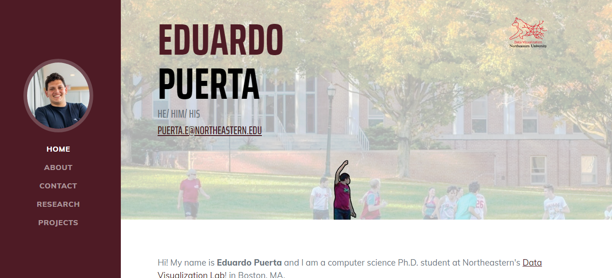
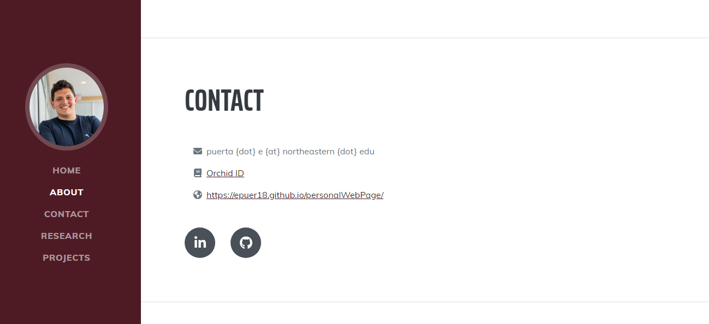
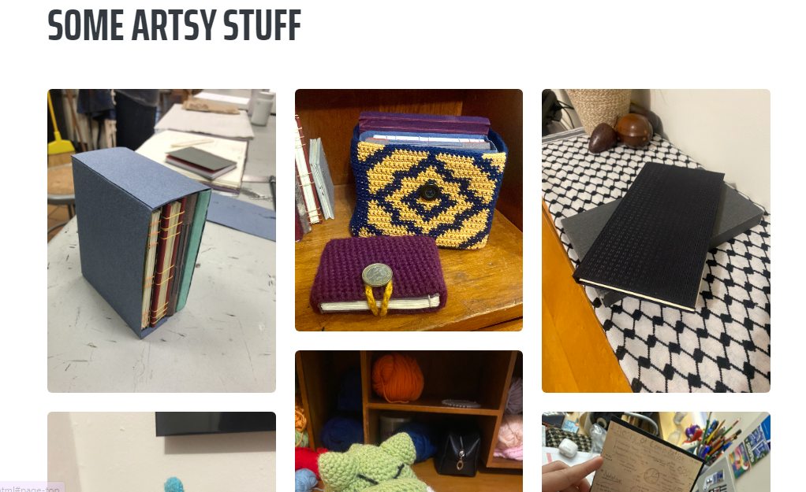

# Eduardo Puerta's Personal Website

## Quick Overview

+ **Author:** Eduardo Puerta
+ **Website Link:** https://epuer18.github.io/personalWebPage/
+ **Class Link:** https://johnguerra.co/classes/webDevelopment_fall_2023/

## Project Details 

### Objective
This project consisted of developing a personal website to highlight and introduce the author. 
This website hosts some of their personal and professional projects, which can help others identify strengths and career opportunities. 
It is also intended to foster the author's public image and community presence. 

### Design Document
The [design document](\documents\CS5610_project1.pdf) of this project can be found in the documents folder. 

### Slides
The [slides](https://docs.google.com/presentation/d/162GO3mUeCwybjkoY9c4ysqjkyhA_QKTxlREQfqyh7zQ/edit?usp=sharing) of this project can be found online by following the hyperlink. 
These are view-only.

### Screenshots

